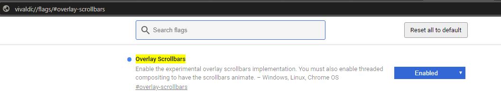

<h1 align="center">Overlay Scrollbars</h1>

  
  
  

## Introduction

Global and GitHub scrollbars customizable themes for Firefox <= 64 and Chrome based browsers

## Installation

Install [Stylus](https://add0n.com/stylus.html) for either [Firefox](https://addons.mozilla.org/en-US/firefox/addon/styl-us/), [Chrome](https://chrome.google.com/webstore/detail/stylus/clngdbkpkpeebahjckkjfobafhncgmne) or [Opera](https://addons.opera.com/en-gb/extensions/details/stylus/) and then install the style:

📦 [Install the GitHub style usercss](https://raw.githubusercontent.com/StylishThemes/Overlay-Scrollbars/master/github-overlay-scrollbars.user.css) Will style your scrollbars just while visiting GitHub 
📦 [Install the Global style usercss](https://raw.githubusercontent.com/StylishThemes/Overlay-Scrollbars/master/global-overlay-scrollbars.user.css) Will style your scrollbars globally 
 
Both support automatic updates and customization. 

## Notes

Chromium browsers have an `Overlay Scrollbars` option to enable it do the following.

1. Type `chrome://flags/#overlay-scrollbars` into address bar
2. Enable: Overlay Scrollbars

For more information visit [Vivaldi forum](https://forum.vivaldi.net/topic/21914/how-to-mod-webpage-scrollbar-with-custom-css/11)

🐛 Bug: Vivaldi up to version 2.2.1388.37 (Stable channel) (64-bit) when not full screen windows size, 
conflicts with scrollbars width less than 6px and cannot be dragged with mouse.

## Known issues

When using the global style in discord without any other themes the scrollbar widths in various panes, 
some side panes don't respect the custom width set.

## Contributions

If you would like to contribute to this repository, please...

1. 👓 Read the [contribution guidelines](./.github/CONTRIBUTING.md).
1.  [Fork](https://github.com/StylishThemes/Overlay-Scrollbars/fork) or  [download](https://github.com/StylishThemes/Overlay-Scrollbars/archive/master.zip) this repository.
1. 👌 Create a pull request!
